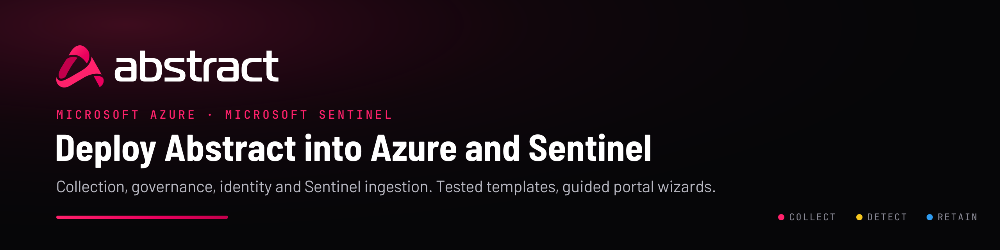

<p align="center">
  
</p>

<p align="center">
  <a href="#start-here"><b>Start here</b></a> &nbsp;·&nbsp;
  <a href="#deploy"><b>Deploy</b></a> &nbsp;·&nbsp;
  <a href="solutions/docs/sentinel-destination-assurance.md"><b>Sentinel assurance</b></a> &nbsp;·&nbsp;
  <a href="#before-you-begin"><b>Requirements</b></a> &nbsp;·&nbsp;
  <a href="#documentation"><b>Docs</b></a> &nbsp;·&nbsp;
  <a href="https://iamabs3c.github.io/Abstract-MS-Azure-/"><b>Deployment console</b></a>
</p>

Azure templates and scripts that connect Microsoft Azure, Microsoft Entra ID and
Microsoft Sentinel to [Abstract Security](https://abstract.security). Every template has a
guided portal wizard, Bicep source and compiled ARM, and CI checks each wizard against its
template.

- **Collect.** Get Azure, Entra ID and Defender telemetry into Abstract through Event Hubs,
  for one subscription or a whole management group.
- **Identity.** Create the app registrations Abstract needs for Microsoft Graph and
  Microsoft 365.
- **Send.** Deliver Abstract's normalized, reduced output to Microsoft Sentinel or to an
  Event Hub.

---

## Start here

| I want to… | Use | Read |
| --- | --- | --- |
| Send Abstract data to **Microsoft Sentinel** | **Microsoft Sentinel Destination** | [Assurance guide](solutions/docs/sentinel-destination-assurance.md) · [ASIM guide](solutions/docs/sentinel-asim.md) |
| Collect **Azure logs** from one subscription | Event Hub (Source), then Activity Log export | [Template reference](solutions/README.md#what-each-template-does) |
| Collect Azure logs from **every subscription** automatically | Event Hub (Source), then Log streams at scale | [Log streams at scale](solutions/docs/azure-log-streams.md) |
| Collect **Entra ID** sign-in, audit and risk logs | Event Hub (Source), then Microsoft Entra ID log streams | [Log streams at scale](solutions/docs/azure-log-streams.md) |
| Let Abstract read **Microsoft Graph / Microsoft 365** | App registrations (event-driven) | [App registrations](solutions/docs/azure-app-registrations.md) |
| Send Abstract data to **an Event Hub** | Event Hub Destination | [Template reference](solutions/README.md#what-each-template-does) |
| Get **alerted** when collection stalls | Pipeline health alerts | [Template reference](solutions/README.md#what-each-template-does) |

> [!IMPORTANT]
> **Connecting a production Sentinel workspace?** Read the
> [Sentinel Destination assurance guide](solutions/docs/sentinel-destination-assurance.md)
> first. It lists everything the templates create, what they can never change, the
> permissions involved, and a rollout and rollback runbook.
>
> In short:
> - Nothing touches your analytics rules, automation, parsers, workbooks or workspace
>   settings.
> - Abstract's identity can only publish to its own Data Collection Rule.
> - Writing Microsoft's ASIM tables is off until you turn it on.

---

## Deploy

Deploy the Event Hub source **first**: every other source template uses its outputs. Each
button opens the template's portal wizard. The CLI command and full details for each
template are in the [template reference](solutions/README.md#what-each-template-does).

<!-- BEGIN GENERATED: deploy-table -->
### Sources — Abstract reads *from* Azure

Get Microsoft telemetry into Abstract. Deploy the Event Hub source first — every other source template consumes its outputs.

| Template | What it does | Scope | Deploy |
| --- | --- | --- | --- |
| **Event Hub (Source)**<br><sub>deploy first</sub> | The Event Hubs namespace and hubs every other source writes to | resource group | [](https://portal.azure.com/#create/Microsoft.Template/uri/https%3A%2F%2Fraw.githubusercontent.com%2FIamABS3C%2FAbstract-MS-Azure-%2Fmain%2Fsolutions%2Ftemplates%2Fsource%2Feventhub-source.azuredeploy.json/createUIDefinitionUri/https%3A%2F%2Fraw.githubusercontent.com%2FIamABS3C%2FAbstract-MS-Azure-%2Fmain%2Fsolutions%2Ftemplates%2Fsource%2Feventhub-source.createUiDefinition.json) |
| **Activity Log export (single subscription)** | Streams one subscription's Activity Log to the hub | subscription | [](https://portal.azure.com/#create/Microsoft.Template/uri/https%3A%2F%2Fraw.githubusercontent.com%2FIamABS3C%2FAbstract-MS-Azure-%2Fmain%2Fsolutions%2Ftemplates%2Fsubscription%2Factivitylog.azuredeploy.json/uiFormDefinitionUri/https%3A%2F%2Fraw.githubusercontent.com%2FIamABS3C%2FAbstract-MS-Azure-%2Fmain%2Fsolutions%2Ftemplates%2Fsubscription%2Factivitylog.uiFormDefinition.json) |
| **Microsoft Entra ID log streams** | Sign-in, audit, provisioning and risk logs for the whole tenant | tenant | [](https://portal.azure.com/#create/Microsoft.Template/uri/https%3A%2F%2Fraw.githubusercontent.com%2FIamABS3C%2FAbstract-MS-Azure-%2Fmain%2Fsolutions%2Ftemplates%2Ftenant%2Fentra-diagnostics.azuredeploy.json/uiFormDefinitionUri/https%3A%2F%2Fraw.githubusercontent.com%2FIamABS3C%2FAbstract-MS-Azure-%2Fmain%2Fsolutions%2Ftemplates%2Ftenant%2Fentra-diagnostics.uiFormDefinition.json) |

### Governance — onboard the whole estate

Stop configuring diagnostic settings one subscription at a time. Assign once at a management group; current and future subscriptions onboard themselves.

| Template | What it does | Scope | Deploy |
| --- | --- | --- | --- |
| **Log streams at scale (Azure Policy)** | Onboards every subscription and resource under a management group | management group | [](https://portal.azure.com/#create/Microsoft.Template/uri/https%3A%2F%2Fraw.githubusercontent.com%2FIamABS3C%2FAbstract-MS-Azure-%2Fmain%2Fsolutions%2Ftemplates%2Fpolicy%2Fabstract-logstreams-policy.azuredeploy.json/uiFormDefinitionUri/https%3A%2F%2Fraw.githubusercontent.com%2FIamABS3C%2FAbstract-MS-Azure-%2Fmain%2Fsolutions%2Ftemplates%2Fpolicy%2Fabstract-logstreams-policy.uiFormDefinition.json) |
| **Pipeline health alerts** | Alerts when the hub stops receiving, throttles or stalls | resource group | [](https://portal.azure.com/#create/Microsoft.Template/uri/https%3A%2F%2Fraw.githubusercontent.com%2FIamABS3C%2FAbstract-MS-Azure-%2Fmain%2Fsolutions%2Ftemplates%2Fmonitoring%2Fpipeline-health-alerts.azuredeploy.json/createUIDefinitionUri/https%3A%2F%2Fraw.githubusercontent.com%2FIamABS3C%2FAbstract-MS-Azure-%2Fmain%2Fsolutions%2Ftemplates%2Fmonitoring%2Fpipeline-health-alerts.createUiDefinition.json) |

### Identity — app registrations for Graph / M365 collection

Event Hub collection needs no app registration. These are for the other source set: Microsoft Graph and the Microsoft 365 unified audit log.

| Template | What it does | Scope | Deploy |
| --- | --- | --- | --- |
| **App registrations (event-driven)** ⭐ | A Logic App that creates a Graph app registration per subscription | resource group | [](https://portal.azure.com/#create/Microsoft.Template/uri/https%3A%2F%2Fraw.githubusercontent.com%2FIamABS3C%2FAbstract-MS-Azure-%2Fmain%2Fsolutions%2Ftemplates%2Fautomation%2Fabstract-appreg-automation.azuredeploy.json/createUIDefinitionUri/https%3A%2F%2Fraw.githubusercontent.com%2FIamABS3C%2FAbstract-MS-Azure-%2Fmain%2Fsolutions%2Ftemplates%2Fautomation%2Fabstract-appreg-automation.createUiDefinition.json) |
| **App registrations (Azure Policy)** | The same, delivered by Azure Policy | management group | [](https://portal.azure.com/#create/Microsoft.Template/uri/https%3A%2F%2Fraw.githubusercontent.com%2FIamABS3C%2FAbstract-MS-Azure-%2Fmain%2Fsolutions%2Ftemplates%2Fpolicy%2Fabstract-appreg-policy.azuredeploy.json/uiFormDefinitionUri/https%3A%2F%2Fraw.githubusercontent.com%2FIamABS3C%2FAbstract-MS-Azure-%2Fmain%2Fsolutions%2Ftemplates%2Fpolicy%2Fabstract-appreg-policy.uiFormDefinition.json) |

### Destinations — Abstract writes *to* Azure

Send Abstract's enriched, normalized output back into Azure.

| Template | What it does | Scope | Deploy |
| --- | --- | --- | --- |
| **Event Hub Destination** | An Event Hub that Abstract writes enriched output to | resource group | [](https://portal.azure.com/#create/Microsoft.Template/uri/https%3A%2F%2Fraw.githubusercontent.com%2FIamABS3C%2FAbstract-MS-Azure-%2Fmain%2Fsolutions%2Ftemplates%2Fdestinations%2Feventhub-destination.azuredeploy.json/createUIDefinitionUri/https%3A%2F%2Fraw.githubusercontent.com%2FIamABS3C%2FAbstract-MS-Azure-%2Fmain%2Fsolutions%2Ftemplates%2Fdestinations%2Feventhub-destination.createUiDefinition.json) |
| **Microsoft Sentinel Destination** | The table, DCE and DCR Abstract writes to Sentinel through | resource group | [](https://portal.azure.com/#create/Microsoft.Template/uri/https%3A%2F%2Fraw.githubusercontent.com%2FIamABS3C%2FAbstract-MS-Azure-%2Fmain%2Fsolutions%2Ftemplates%2Fdestinations%2Fsentinel-destination.azuredeploy.json/createUIDefinitionUri/https%3A%2F%2Fraw.githubusercontent.com%2FIamABS3C%2FAbstract-MS-Azure-%2Fmain%2Fsolutions%2Ftemplates%2Fdestinations%2Fsentinel-destination.createUiDefinition.json) |
| **Sentinel Destination + app registration** | The same, plus the Entra app and secret (lab use) | resource group | [](https://portal.azure.com/#create/Microsoft.Template/uri/https%3A%2F%2Fraw.githubusercontent.com%2FIamABS3C%2FAbstract-MS-Azure-%2Fmain%2Fsolutions%2Ftemplates%2Fdestinations%2Fsentinel-destination-with-app.azuredeploy.json/createUIDefinitionUri/https%3A%2F%2Fraw.githubusercontent.com%2FIamABS3C%2FAbstract-MS-Azure-%2Fmain%2Fsolutions%2Ftemplates%2Fdestinations%2Fsentinel-destination-with-app.createUiDefinition.json) |
<!-- END GENERATED: deploy-table -->

<sub>The tables are generated from
[`solutions/solution.manifest.json`](solutions/solution.manifest.json), and CI fails if
they drift.</sub>

---

## Before you begin

| For | You need |
| --- | --- |
| Event Hub source and destination, Sentinel destination | Contributor on the target resource group; Owner, or Contributor plus User Access Administrator, where the template creates role assignments |
| Activity Log export | Monitoring Contributor on the subscription |
| Log streams at scale | Owner, or Resource Policy Contributor plus User Access Administrator, on the management group |
| Microsoft Entra ID log streams | Security Administrator on the tenant |
| App registrations (bootstrap) | Global Administrator, once per tenant, to grant admin consent |
| Tooling (CLI path) | Azure CLI 2.60 or later, Bicep 0.44 or later, Python 3.8 or later, PowerShell 7 for the `.ps1` scripts |

Deploy-to-Azure buttons read the templates from this public repository. For a private copy,
use the CLI or the template-spec commands in the
[template reference](solutions/README.md#the-fully-documented-alternative-template-specs).

---

## Quick start (CLI)

```bash
# 1. Event Hub source. Deploy first; the other source templates use its outputs.
az deployment group create -g rg-abstract \
  --template-file solutions/templates/source/eventhub-source.bicep \
  --parameters namespaceName=<globally-unique-name>

# 2. Onboard the whole estate in report-only mode. This changes nothing; it reports
#    which subscriptions and resources would be collected.
./solutions/scripts/Deploy-AbstractLogStreams.sh -a Deploy \
  -m <management-group-id> -p solutions/parameters/logstreams-policy.parameters.json

# 3. Let the policy identities write to the hub, then backfill existing resources.
#    DeployIfNotExists never touches existing resources on its own.
./solutions/scripts/Deploy-AbstractLogStreams.sh -a Grant     -m <mg-id> -n <namespace-id>
./solutions/scripts/Deploy-AbstractLogStreams.sh -a Remediate -m <mg-id>

# 4. Entra ID logs for the whole tenant.
az deployment tenant create -l eastus \
  --template-file solutions/templates/tenant/entra-diagnostics.bicep \
  --parameters eventHubAuthorizationRuleId=<rule-id> eventHubName=<entra-hub>

# 5. Sentinel destination into an existing workspace (ASIM stays off).
az deployment group create -g <workspace-rg> --mode Incremental \
  --template-file solutions/templates/destinations/sentinel-destination.bicep \
  --parameters createWorkspace=false workspaceName=<workspace> principalId=<abstract-sp-object-id>
```

---

## How it fits together

```
 Azure estate ──(Azure Policy, once per management group)──┐
 Entra ID ─────(one tenant diagnostic setting)─────────────┤
                                                           ▼
                                   Event Hubs (one namespace per region)
                                                           │
                                                           ▼
                        Abstract Security: normalize · enrich · reduce · detect
                                   │                              │
                                   ▼                              ▼
                        Microsoft Sentinel                  Event Hub destination
                  (Logs Ingestion API → DCR → table,
                   optional ASIM tables)

 Microsoft Graph / Microsoft 365: Abstract polls them through an app registration.
```

Three constraints drive the design, each explained in the
[template reference](solutions/README.md#three-constraints-that-decide-every-design-here):
- Event Hubs must be in the same region as the resources that send to them.
- Azure Policy's DeployIfNotExists needs a remediation task to reach existing resources.
- New subscriptions land in the tenant root group unless you change the default.

---

## Documentation

| Guide | What it covers |
| --- | --- |
| [Sentinel Destination assurance](solutions/docs/sentinel-destination-assurance.md) | What the Sentinel templates and the Abstract destination create, change and never touch; identities; ASIM impact; cost; rollout and rollback |
| [Sending Abstract data into Sentinel (ASIM)](solutions/docs/sentinel-asim.md) | How events map into Microsoft's ASIM tables, what that covers, and Microsoft's first-party tables no outside sender can write |
| [Azure log streams at scale](solutions/docs/azure-log-streams.md) | Every Microsoft log stream, how each reaches an Event Hub, and which Azure Policy can onboard |
| [App registrations](solutions/docs/azure-app-registrations.md) | Both automated paths, the verified Graph permission catalogue, and their trade-offs |
| [Template reference](solutions/README.md) | Every template's scope, files, outputs, CLI and template-spec commands, and what was verified |
| [Sentinel content pack](solution/README.md) | Optional connector tile, parser, rules, hunting queries, workbooks and playbooks |
| [Contributing](CONTRIBUTING.md) | Generators, CI checks, customizing and porting this repository |
| [Changelog](CHANGELOG.md) | What changed, release by release |

---

## Repository layout

```
solutions/                 The deployable templates (portable, self-contained)
├── templates/             source · subscription · tenant · policy · automation · monitoring · destinations
├── asim/                  ACS → Microsoft ASIM mappings (one per schema)
├── parameters/            Ready-to-edit parameter files and generated schemas
├── scripts/               Deployment drivers, validators and generators
├── docs/                  Guides
├── brand/                 Official Abstract logos and README artwork
├── ci/                    CI helpers
└── solution.manifest.json Source of truth for templates, docs and repository coordinates
solution/                  Optional Microsoft Sentinel content pack
docs/                      GitHub Pages deployment console (generated)
```

---

## Support

- **Abstract documentation:** [docs.abstractsecurity.app](https://docs.abstractsecurity.app)
  ([Azure Sentinel Destination](https://docs.abstractsecurity.app/docs/integrations/destination-integrations/azure-sentinel-destination/))
- **Abstract Security:** [abstract.security](https://abstract.security)
- **Issues and changes:** open an issue or pull request in this repository.

<p align="center">
  <picture>
    <source media="(prefers-color-scheme: dark)" srcset="solutions/brand/abstract-logo-white.png">
    
  </picture>
  <br>
  <sub>Abstract Security — the security data pipeline platform · <a href="LICENSE">MIT license</a></sub>
</p>
